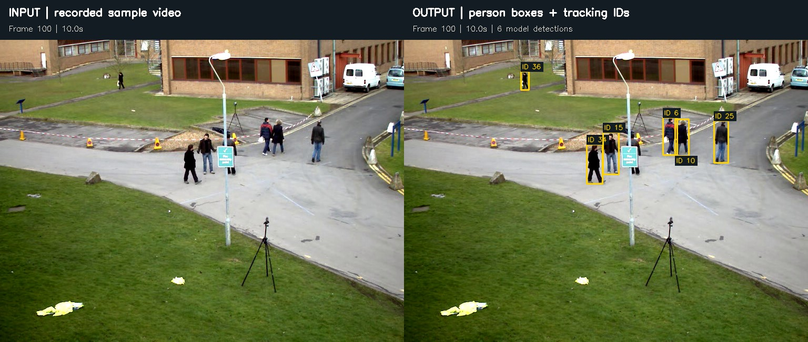
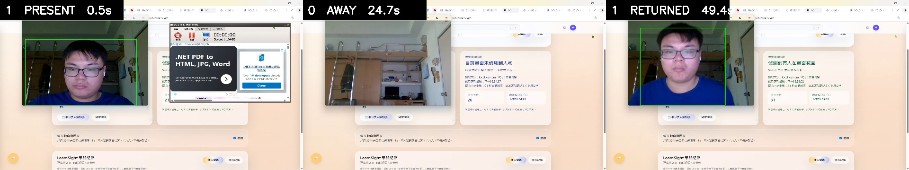
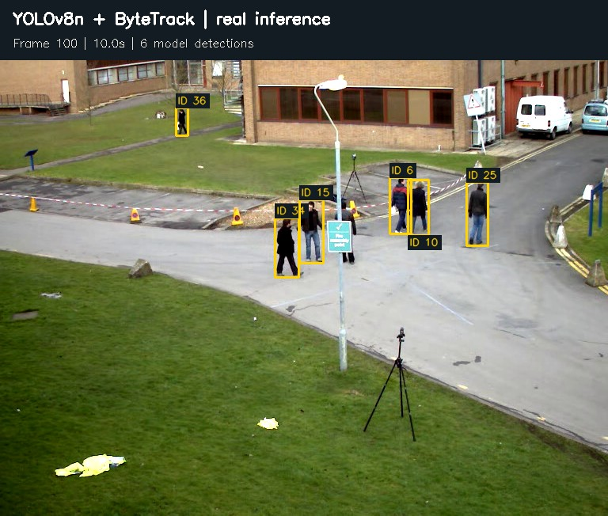
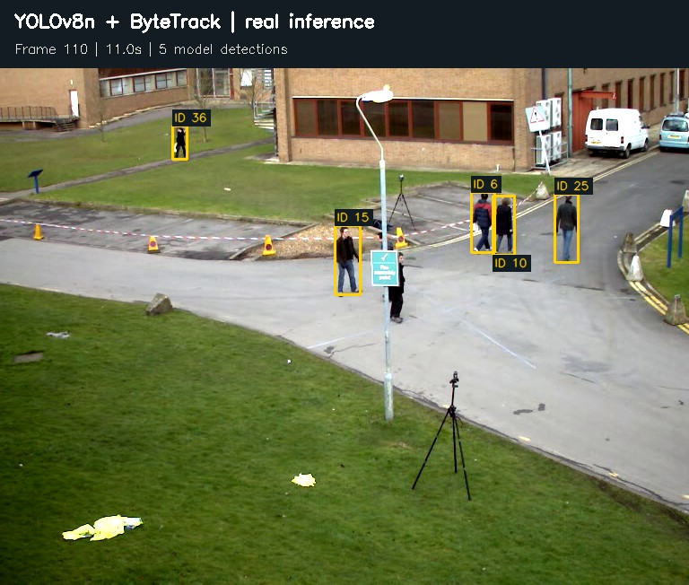
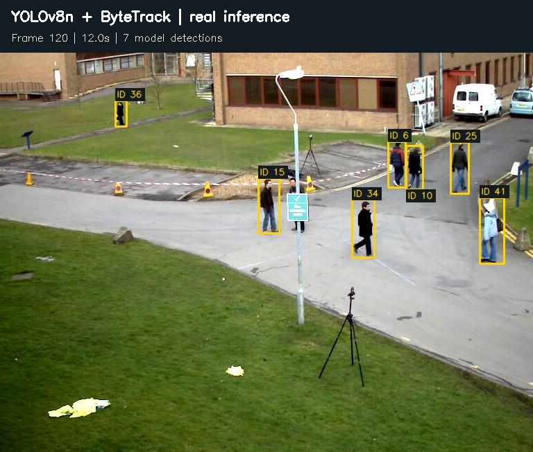
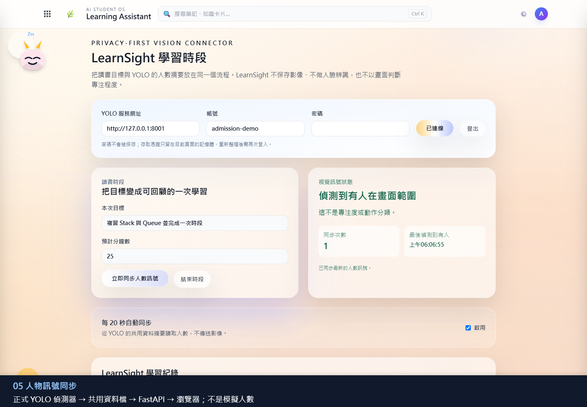

# 第一次看懂 YOLO：真實人物偵測成果與操作

本頁展示「把一段影片交給模型，取得人物位置與跨影格追蹤編號」的實際結果。圖片於 2026-09-11 使用本機既有的 `sample.avi`、YOLOv8n 預訓練權重及 ByteTrack 產生，不是手動畫框、AI 生成示意圖，也不是學生動作分類成果。

## 1. 輸入與輸出有什麼不同？



左邊是第 100 影格的原始畫面，右邊是同一張畫面的模型輸出。黃色框代表模型找到的人物位置；短標籤是追蹤編號。模型在這一格輸出 **6 個人物框**。這是「模型偵測到的數量」，不是人工核對過的現場真實人數。

| 圖片／結果中的項目 | 白話解釋 | 不能推論的事情 |
| --- | --- | --- |
| 人物框（bounding box） | 用矩形標出模型認為有人出現的位置 | 框出人物不表示已識別他的動作 |
| `person` 類別 | 本次只保留人物類別，汽車等類別不列入 | 不會分辨學生、老師或其他身分 |
| `ID 6` 等編號 | 追蹤器嘗試把相鄰畫面的同一個人物接起來 | 不是人臉辨識，不是學號；遮擋可能導致編號改變 |
| 信心分數（confidence） | 模型對單一人物候選框的分數，本次門檻為 0.25 | 0.86 不是整個系統的 86% 準確率 |
| 每格人物數 | 該影格輸出的框數，可作為後續聚合訊號 | 不等於專注程度、學習成效或精確出席紀錄 |

為避免多人靠近時文字互相遮擋，圖片只顯示短 ID；完整框座標、分數與 ID 留在 [推論紀錄](assets/detection/inference-manifest.json) 中。第 100 影格各框的分數約介於 0.62 至 0.86，分數高低本身不能代替人工標註評估。

## 2. 本人前置鏡頭與 LearnSight 的完整流程



[觀看 67.9 秒完整實測影片](assets/learnsight-front-camera-1-0-1-demo.mp4)

2026-09-14 使用本人筆電前置鏡頭進行驗證：開始時偵測到 1 人，離開畫面後為 0 人，返回後再次為 1 人。這是同一段連續錄影，不是三張互不相關的示意圖。可佐證的範圍是人物偵測訊號能經 FastAPI 傳入 LearnSight；尚未完成學生動作分類，也不能由人物存在推論專注度或學習成效。

## 3. 連續畫面：追蹤不是只在一張照片上畫框

模型依序處理第 0 至 120 影格，再抽出下列三格；因此追蹤器保留了前面畫面的資訊。影格編號從 0 開始，時間是影片內的時間，不是模型運算耗時。

### 10 秒：6 個人物框



### 11 秒：5 個人物框



### 12 秒：7 個人物框



| 影格 | 影片時間 | 模型框數 | 本次輸出的追蹤 ID |
| --- | --- | --- | --- |
| 100 | 10.0 秒 | 6 | 6、10、25、34、36、15 |
| 110 | 11.0 秒 | 5 | 6、10、25、36、15 |
| 120 | 12.0 秒 | 7 | 6、10、25、36、15、34、41 |

可以觀察 ID 6、10、25、36、15 持續出現在三格中；ID 34 在中間這格沒有輸出、下一格再次出現。單憑這三格，不能判定人員真的離開又返回，也不能把新增 ID 當成一定有新的人進場。遮擋、漏偵測、追蹤恢復與編號切換都需要回看影片、人工標註後才能判斷。

## 4. 我可以用自己的影片做出什麼？

先完成 [README 安裝步驟](../README.md#快速開始本機影片-demo)，啟用同一個 Python 虛擬環境。請使用自己有權處理的影片，不要把他人的教室／人臉影片直接公開。

### A. 看本機影片上的人物框

```powershell
python scripts/detect_demo.py "C:\path\to\your-video.mp4" --duration 30 --show
```

將路徑替換成自己電腦上真正存在的影片。`--duration 30` 限制展示執行時間，`--show` 開啟本機偵測視窗。首次使用可能需要下載 YOLO 權重；CPU 可執行，但速度會受硬體與畫面大小影響。

### B. 匯出像本頁一樣的成果照片

```powershell
python scripts/export_detection_examples.py --video "C:\path\to\your-video.mp4" --weights yolov8n.pt --outdir runs/visual-guide
```

| 輸出檔案 | 用途 |
| --- | --- |
| `before-after.jpg` | 第 100 影格的輸入與輸出對照 |
| `detection-100.jpg`、`detection-110.jpg`、`detection-120.jpg` | 三個時間點的人物框照片 |
| `inference-manifest.json` | 保存檔案雜湊、模型參數、框座標、分數與追蹤 ID，方便追查來源 |

影片至少要有 121 個可解碼影格。不同影片幀率不同，第 100 影格不一定是第 10 秒。程式只讀本機影片、不開啟攝影機；這是獨立成果匯出工具，**不會同步更新後端、場域事件或 LearnSight 時段**。若要展示完整服務，請使用上方 A 的 demo 流程與下一節。

### C. 把人物數連接到 LearnSight

1. 在第一個終端機執行 `python scripts/serve_demo.py`，依畫面建立或登入帳號。
2. 在第二個終端機執行上方 A 的影片 demo。
3. 開啟 `http://127.0.0.1:8000/learnsight.html`，開始讀書時段。
4. 按「同步影片偵測人數」，觀察人物訊號；結束時段時查看摘要。
5. 如果使用手動「有人／無人」按鈕，展示時必須註明是模擬訊號。



這張圖是先前保存的 LearnSight 整合介面截圖，不是本次 `sample.avi` 的同步畫面。它說明人物訊號最後可以接到哪裡，不能當作本次完整服務聯測的證明。LearnSight 目前沒有可靠的專注度判斷，時段存於服務記憶體，重啟會清除。

[三專案截圖與流程解說影片](assets/三專案_截圖與流程解說.webm)：既有截圖組成的流程解說，**不是本次 YOLO 連續推論錄影**。

## 4. 本次實測條件與成果界線

| 項目 | 本次設定／驗證 |
| --- | --- |
| 模型／追蹤器 | YOLOv8n 預訓練模型／ByteTrack，並非自行從零訓練人物模型 |
| 執行裝置 | CPU |
| 推論設定 | `classes=[0]`、`conf=0.25`、`iou=0.7`、`imgsz=640`、`persist=True` |
| 真正執行的部分 | 影片解碼、逐影格模型推論、追蹤、標記圖片匯出、JSON 紀錄 |
| 未由本次驗證的部分 | 攝影機、API／介面同步、線段／區域事件、動作分類、正式準確率 |
| 可追溯性 | [匯出程式](../scripts/export_detection_examples.py) 與 [輸入／權重 SHA-256 紀錄](assets/detection/inference-manifest.json) |

原始影片是開發資料夾中既有的戶外範例 `sample.avi`，本次未確認原始拍攝者與授權條款；不主張為林琨茂自行拍攝，也不把這些影格宣告為可自由再散布的素材。本頁僅用少量影格說明模型實際輸出，未附原始影片或權重。若再利用影像，仍需確認來源與授權；使用自有影片可以重現同樣的操作流程，但框數與追蹤 ID 不會與本頁相同。

## 5. 備審與口試可以怎麼介紹？

> 我以既有 YOLO 人物偵測模型與 ByteTrack 為基礎，製作人物偵測及 LearnSight 整合原型，將影片輸入、人物位置／追蹤編號、資料處理與網頁展示串接成流程。這組成果圖呈現實際逐影格推論，而不是模型訓練準確率。我能解釋輸入來源、參數、輸出資料與功能限制；目前尚未完成學生動作分類或專注度驗證。

本專題由林琨茂個人發想與製作，過程大量使用 AI 協助程式產生、修改與文件整理。呈現的是需求規劃與系統整合經驗，不應描述成所有程式碼皆獨立手寫或自行發明 YOLO／ByteTrack。

